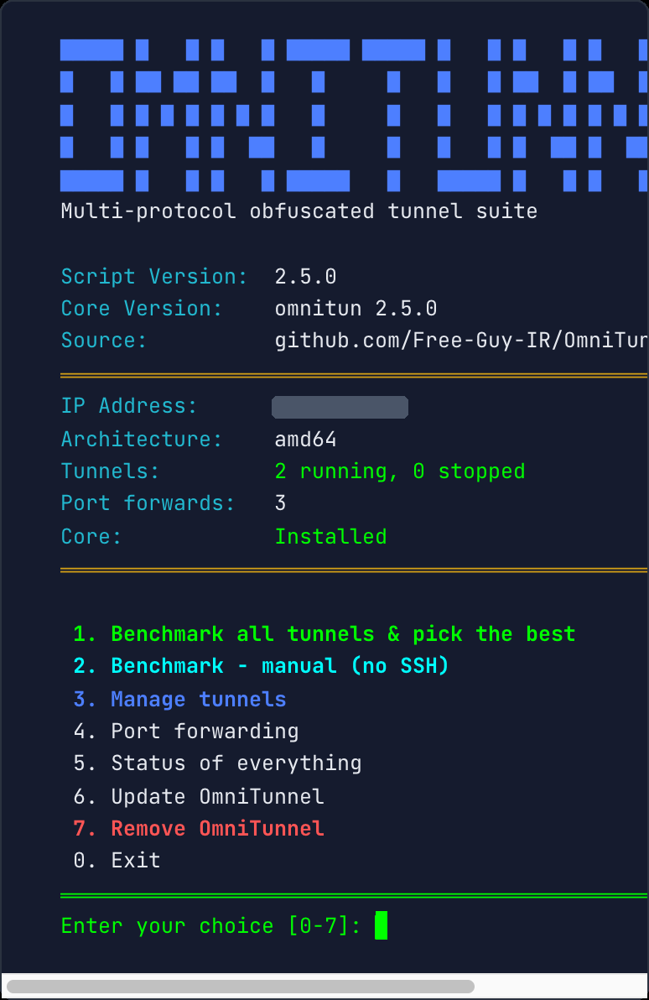

<p align="center">
  
</p>

# OmniTunnel

**A multi-protocol, obfuscated tunnel suite for bypassing per-destination
traffic policing and DPI.** Prebuilt static binaries, one English
menu-driven manager, sixteen interchangeable tunnel transports, and any
many-to-many topology you need.

Built and hardened against real Iran ⇄ abroad conditions, where different ISPs
police, throttle, or block traffic very differently depending on the transport
and the destination datacenter. (Formerly the ICMP-only `icmptun` project —
ICMP is now just one transport among many.)

---

## Why so many transports?

No single tunnel wins everywhere. What an ISP lets through — and how fast — is
**per-route and per-transport**, and it changes. OmniTunnel ships them all and
lets you **benchmark them and keep the winner**:

| Mode | What it is | Best when |
|------|------------|-----------|
| `gre`  | IP-over-GRE, native kernel tunnel (no key) | The ISP polices TCP/UDP but leaves protocol-47 alone — often **full line-rate** |
| `icmp` | IP-over-ICMP, blends in as ping (no key) | Only ICMP passes untouched — frequently unpoliced too |
| `udp`  | IP-over-UDP, XChaCha20-Poly1305, no header/handshake | UDP is allowed — usually the fastest of the encrypted carriers |
| `tcp`  | IP-over-TCP, one connection that looks like a long HTTPS session | UDP is blocked but a single TCP stream runs clean |
| `mux`  | **Multi-connection TCP** — N parallel links, each inner flow pinned to one link | Hostile DPI that blocks UDP *and* poisons long-lived TCP 5-tuples |
| `ws`   | **Multi-connection WebSocket** — real HTTP `Upgrade` handshake, AEAD payload inside masked WS frames | You need `mux`'s throughput but the carrier must be **indistinguishable from a browser/CDN WebSocket** on 443/80 |
| `hysteria` | **Hysteria2 / QUIC** — bundled engine with the loss-agnostic *Brutal* congestion control, salamander obfuscation and a real website masquerade | UDP passes but is **rate-policed or lossy**: Brutal ignores the induced loss and pushes at a fixed rate, so a policed UDP path that crawls at a few Mbit for `udp` runs an order of magnitude faster here — while looking exactly like HTTP/3 |
| `fou`  | **GRE-in-UDP** (Foo-over-UDP), native kernel tunnel (no key) — a GRE tunnel wrapped inside an ordinary UDP packet on a port you choose | You want GRE's near-line-rate speed but the ISP blocks raw protocol-47, or the carrier must **look like plain UDP** instead of a GRE tunnel |
| `vxlan` | **VXLAN**, native kernel tunnel (no key) — Ethernet-in-UDP, the standard datacenter overlay | A kernel UDP carrier that blends in as ordinary overlay traffic; useful where `fou`'s GRE-in-UDP is fingerprinted but VXLAN is not |
| `wg` | **WireGuard** — kernel-native ChaCha20-Poly1305, on an auto-allocated port well clear of the 51820-51899 range some IR ISPs block outright | You want a mature, fast, genuinely encrypted kernel tunnel. **Not a stealth option**: the WireGuard handshake has a recognisable shape, so a DPI box that looks for it will find it |
| `geneve` |
 **GENEVE**, native kernel tunnel (no key) — the other standard datacenter overlay, Ethernet-in-UDP with a different (extensible) header than VXLAN | VXLAN itself is fingerprinted; GENEVE is the same idea on a different wire shape. Note the kernel gives GENEVE no `local` option, so the outer source address is whatever routing picks |

### GRE header variants

The base GRE header is 4 bytes, and every optional field the kernel appends
changes the shape a DPI box sees on the wire. These ship as separate transports
so that when one shape gets fingerprinted and throttled you can benchmark the
rest and keep whatever still runs. All of them are plaintext kernel carriers —
same speed class as `gre`, same lack of encryption.

| Mode | What it changes | Best when |
|------|-----------------|-----------|
| `gre-seq`  | adds the GRE **sequence** field (+4B) | the plain `gre` header shape is recognised and policed |
| `gre-csum` | adds the GRE **checksum** field (+4B, small CPU cost) | as above, and a third shape is needed |
| `gre-tos`  | marks the **outer** IP header **DSCP EF** (the class real VoIP uses) | the ISP runs a priority queue for voice traffic — sometimes a large win, often a no-op where the carrier rewrites DSCP at its edge |
| `gretap`   | **Ethernet**-in-GRE instead of IP-in-GRE (L2, /24 addressing) | a different proto-47 payload shape; also needed if you want to bridge |
| `fou-seq`  | `fou` with the sequence field on the inner GRE header | the plain `fou` shape is fingerprinted |
| `gue`      | **GRE-in-GUE** — UDP encap with a different header than `fou` | `fou`'s UDP encapsulation is recognised but GUE is not |
| `gretap-fou` | Ethernet-in-GRE hidden inside plain UDP | you need `gretap`'s payload shape but raw protocol-47 is blocked |

> **These carriers do not encrypt anything.** A GRE "key" is a cleartext demux
> tag from RFC 2890, not a password, and every GRE variant ships the **inner IP
> header in the clear** — an observer sees your real inner source, destination
> and ports. Only `udp`/`tcp`/`mux`/`ws` (XChaCha20-Poly1305) and `hysteria`
> actually encrypt. Pick a GRE variant for speed on a link where the ISP polices
> the encrypted carriers, and run something already encrypted inside it.

Many ISPs police only the *common* transports (TCP/UDP) and pass the "tunnel"
protocols — GRE (IP proto 47) and ICMP — at the link's real physical rate. On
one heavily-filtered Iran ISP tested, TCP/UDP were crushed to ~1 Mbit while
**GRE ran at ~650 Mbit and ICMP at ~350 Mbit** to the same foreign box. That is
exactly why you benchmark first and keep the winner. `gre`/`icmp` are plaintext
carriers (the inner proxy traffic is already encrypted); `udp`/`tcp`/`mux` add
their own XChaCha20-Poly1305.

The `mux` transport is the headline. On an ISP that blocks UDP and drops ~half
of new TCP handshakes, a naive single TCP tunnel melts down to a fraction of
the path. `mux` opens N links (each retried from a **fresh source port** until
one lands), spreads inner flows across them, and paces the aggregate just under
the raw rate so the links never overshoot — reaching **~90% of the raw path
speed** where a single tunnel managed under 15%.

All obfuscated transports are **unsignatured**: a random 24-byte nonce followed
by AEAD ciphertext, no magic bytes, no plaintext handshake — indistinguishable
from random traffic to a DPI box.

---

## Install

No compiler needed — the right static binary for your CPU (**amd64** or
**arm64**) ships with the project.

### Run this one line on your **Iran** server:

```bash
bash <(curl -fsSL https://raw.githubusercontent.com/AlirezaNorouzzadeh9/OmniTunnel/main/install.sh) && omnitunnel
```

That's it. You run it **only on the Iran side**. When you add a tunnel (or run
the benchmark), the manager asks for the foreign server's IP and SSH login and
then **installs and configures the foreign side for you automatically over
SSH** — deploys the matching binary for the foreign box's CPU, brings up the
server end, and enables it on boot. You never have to log into the foreign box
by hand.

> Prefer to set the foreign side up yourself? Just run the same one-liner there
> too — the tool is symmetric.

From a checkout instead of the one-liner:

```bash
git clone https://github.com/AlirezaNorouzzadeh9/OmniTunnel
cd OmniTunnel && sudo ./install.sh && omnitunnel
```

---

## First run: benchmark & pick the best

From the main menu choose **“Benchmark all tunnels & pick the best.”** Point it
at a foreign server (IP + SSH login) and it will:

1. measure the **raw** path (download + rtt),
2. bring up each tunnel in turn and measure **download, packet
   loss and ping** through it,
3. print a comparison table,
4. **remove every test tunnel from both sides**, then let you keep exactly one
   as a permanent instance.

Real numbers, measured end-to-end through the manager on a fast Iran→foreign
route — an Iran server to a foreign box:

```
──────────────────────────  Benchmark results  ──────────────────────────

  raw path (plain TCP)   1.91 Gbits/sec   rtt 39 ms

    TYPE      DOWNLOAD              LOSS   PING
  → gre       ██████████████ 925M    0%     39    fastest
    fou       █████████████  885M    0%     39    stealth pick
    tcp       ██████████     643M    0%     41
    vxlan     ████████       561M    0%     39
    ws        ████████       554M    0%     44
    mux       ████████       508M    0%     43
    udp       ███████        480M    0%     40
    icmp      ███████        439M    0%     40
    hysteria  ███            193M    0%     44
```

The bar is scaled to the fastest tunnel; **→** marks the outright winner and
**stealth pick** marks the fastest *fully obfuscated* transport. Here kernel `gre` leads at 925 Mbit and `fou` (GRE-in-UDP) sits right behind at
885 while looking like ordinary UDP on the wire — and the encrypted `tcp`, `ws`
and `mux` carriers all clear 500 Mbit on this path too. (This ISP polices neither
plain TCP nor arbitrary UDP; it only blocks the narrow WireGuard port range,
which `fou`/`vxlan`/`udp` sidestep.)

The winner is **link-specific**: where the ISP fingerprints GRE the encrypted
UDP carriers lead, where it rate-crushes UDP the plaintext `gre`/`icmp` do, and
on a lossy path `hysteria` does. Nothing wins everywhere — which is the whole
point of benchmarking: **run it on your own link and keep the winner.** Re-run it
from the menu any time conditions change.

> A real measurement taken end-to-end through the manager on one representative
> route; your own link will land differently — benchmark it and keep the winner.

---

## When the foreign box can't be reached over SSH

Some Iran ISPs block **outbound port 22** (and DNS to GitHub) entirely, so the
automatic "set up the far side over SSH" step can't run. Two built-in ways
around it — **neither touches any server's own SSH or port 22:**

**1. Manual mode (no SSH at all).** From the manage menu pick *“Add a tunnel —
MANUAL”*, or:

```bash
omnitunnel add-manual mux main <foreign_ip> 16 90mbit
```

It brings up the near (Iran) side and prints two lines to paste on the foreign
box (which abroad can reach GitHub fine):

```bash
bash <(curl -fsSL https://raw.githubusercontent.com/AlirezaNorouzzadeh9/OmniTunnel/main/install.sh)
omnitunnel server-token <token>
```

The `<token>` carries the key, port and addresses — the tunnel comes straight
up. No SSH between the two boxes is ever used.

**2. A non-standard SSH port on the foreign.** If the far side's sshd does not
listen on 22, the add wizard and the benchmark both ask for it ("Far SSH port"),
or set `OMNITUN_PEER_PORT` for the scripted path:

```bash
OMNITUN_PEER_PASS=... OMNITUN_PEER_PORT=2222 omnitunnel add-auto gre main <foreign_ip>
```

Leaving it blank keeps the previous behaviour exactly: no `-p` is passed, so the
port is whatever ssh itself resolves — including a `Host`/`Port` entry in
`~/.ssh/config`. That matters, because an explicit `-p 22` would override such an
entry and silently break a foreign box that is only reachable through it.

**3. SOCKS5 proxy for provisioning.**
 If you already have a working SOCKS5 proxy
on the Iran box, the auto setup can tunnel its SSH/SCP through it (as the
original icmptun did) — save a peer with a proxy and the manager adds
`ProxyCommand=nc -X 5 -x host:port` to every provisioning connection.

> The tunnel always uses **its own port** (e.g. 51820), never 22. Installing or
> running OmniTunnel never changes any server's SSH login or SSH port.

---

## Topologies (many-to-many)

Each tunnel is an **instance** with its own tun device, systemd unit, subnet,
port and port-forward chain, so any shape works and instances never collide:

- **one Iran → many foreign** — add several instances on one box
- **many Iran → one foreign** — the foreign box hosts one server instance per
  Iran box
- **many → many** — any combination of the above

The manager auto-allocates a non-overlapping subnet and a free port for every
new instance, and (given an SSH login to the far side) brings up both ends.

---

## Port forwarding

Expose a port on one side and have it tunneled to the other:

```bash
omnitunnel pf-add <instance> both 443     # tcp+udp 443 -> peer over the tunnel
omnitunnel pf-add <instance> tcp  8080
omnitunnel pf-del <instance> 443
```

or use the **Port forwarding** menu.

---

## CLI (for scripting)

```bash
omnitunnel add                       # interactive add wizard
omnitunnel add-auto <type> <name> <foreign_ip> [nconn] [shape] [my_ip]
omnitunnel list
omnitunnel status  <instance>
omnitunnel remove  <instance>        # removes ONLY that instance (both-side safe)
omnitunnel pf-add  <instance> <tcp|udp|both> <port>
omnitunnel bench
# only a few transports (a full 18-transport run takes ~20 min on a 40 ms link):
OMNITUN_BENCH_TYPES="gre icmp udp tcp mux ws hysteria fou" omnitunnel bench
omnitunnel update                    # pull the latest from GitHub (see below)
omnitunnel uninstall                 # remove every tunnel + all files, incl. itself
```

The core binary can also be driven directly:

```bash
omnitun mux -L <local-ip> -R <peer-ip> -A <local-tun-ip> -P <peer-tun-ip> \
            -p <port> -k <64-hex-key> -N 16 [-s] -T <dev> -M 1400
omnitun udp  ...     omnitun tcp  ...     omnitun icmp ...
```

`-s` marks the server (listening) side; the client omits it.

---

## Updating & removing

**Update.** Re-running the one-liner is the update path — it's idempotent and
version-aware:

```bash
bash <(curl -fsSL https://raw.githubusercontent.com/AlirezaNorouzzadeh9/OmniTunnel/main/install.sh) && omnitunnel
```

It detects the installed version, refreshes the manager and the core binaries,
and **only if the version actually changed** restarts the running tunnels so they
pick up the new core (an unchanged version touches nothing). Or do it from inside
the tool — main menu → **Update OmniTunnel** — or `omnitunnel update`. A box with
no direct GitHub egress is updated the same way you first set it up: re-push the
files from a box that can reach GitHub.

**Uninstall.** Main menu → **Uninstall**, or `omnitunnel uninstall`. It removes
every tunnel it created (including any leftover `bench-*`), their units, relays,
tun devices and iptables chains, the core binaries, all state under
`/etc/omnitunnel`, and finally its own files in `/opt/omnitunnel` and the
`omnitunnel` command. It never touches anything it didn't create.

---

## Architecture

- **One static core binary** (`omnitun`) — a busybox-style multi-call program
  that dispatches to `udp` / `tcp` / `mux` / `ws` / `icmp`. No shared-library
  dependencies: crypto is vendored ([Monocypher](https://monocypher.org),
  XChaCha20-Poly1305), so it builds and cross-compiles trivially and runs on
  any modern Linux kernel.
- **Bundled `hysteria` engine** — the `hysteria` transport is powered by the
  upstream [Hysteria2](https://github.com/apernet/hysteria) static binary,
  shipped in [`bin/`](bin/) for both CPUs. The manager generates its YAML
  (salamander obfs + website masquerade + self-signed TLS) and runs it under
  systemd. The engine keeps an always-on localhost SOCKS5, and each **TCP
  port-forward is a tiny standalone relay** that dials through that SOCKS5 as
  its own systemd unit — so adding or removing a forward starts/stops one relay
  and **never restarts the engine or disturbs the live QUIC session or other
  forwards** (UDP forwards are the one exception and still live in-config). No
  tun device or iptables DNAT is used for this type.
- Prebuilt for **amd64** and **arm64** under [`bin/`](bin/), also attached to
  each release.
- **`omnitunnel.sh`** — the English TUI manager: benchmark, instance
  add/remove/restart, port forwarding, systemd persistence, BBR + fq/tbf
  tuning, and automatic far-side provisioning over SSH.
- State lives under `/etc/omnitunnel` and never touches an existing
  `/etc/icmptun` install.

Build from source (any Linux with gcc):

```bash
cd src
gcc -O2 -Wall -o omnitun main.c obsctun.c obsctcp.c obscmux.c icmptun.c monocypher.c -lpthread -static
# arm64:
aarch64-linux-gnu-gcc -O2 -Wall -o omnitun-arm64 main.c obsctun.c obsctcp.c obscmux.c icmptun.c monocypher.c -lpthread -static
```

---

## Notes on performance

- Throughput is **per-route and time-variable**; benchmark on your own pair of
  servers, and re-benchmark whenever conditions change.
- No tunnel exceeds the raw path — obfuscation defeats *recognition/policing*,
  not physics. If the raw route to a given foreign datacenter is capped, pick a
  different foreign IP/datacenter.
- `mux` performs best with a shaper set a touch under the raw rate (the add
  wizard asks); use the sustainable, not the burst, path capacity.

---

## License

MIT — see [LICENSE](LICENSE).
